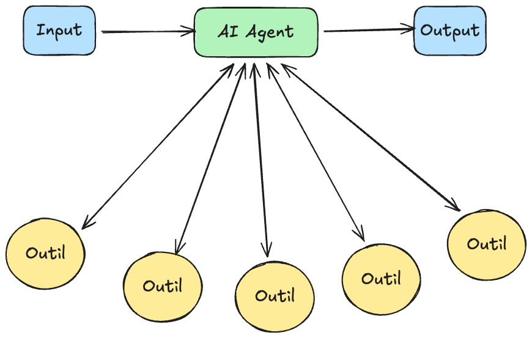
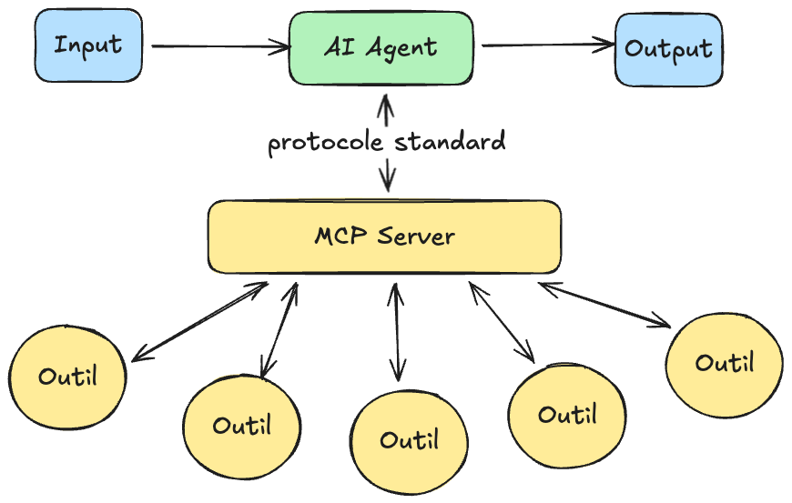
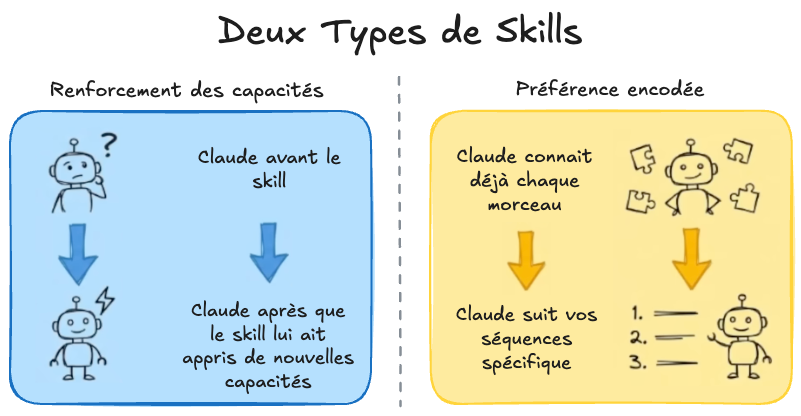
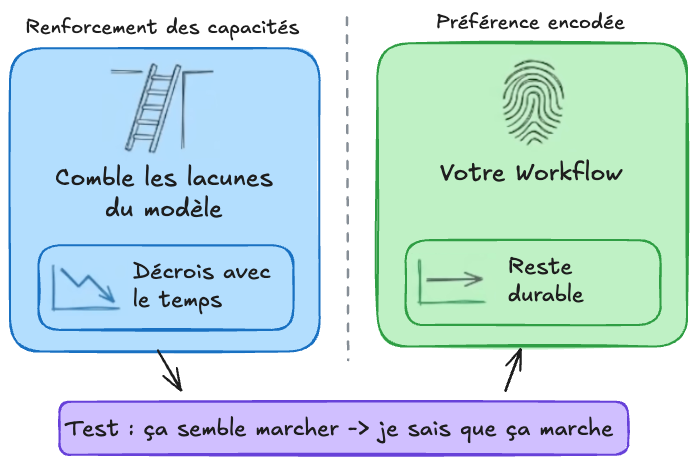
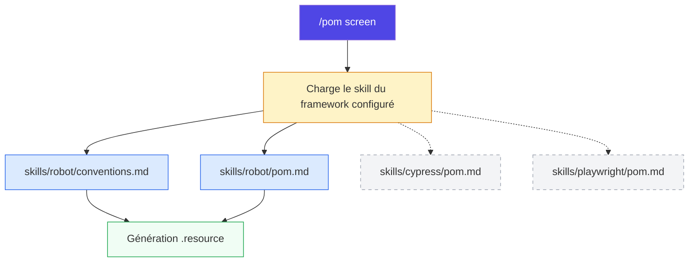
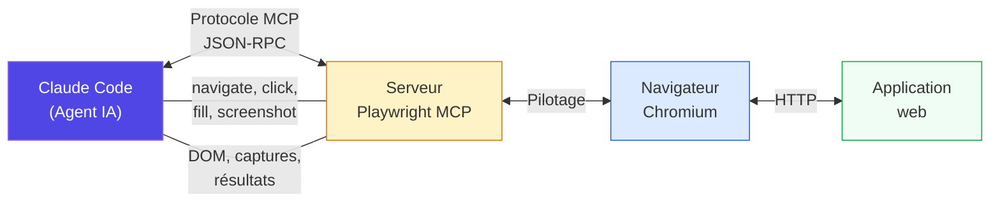
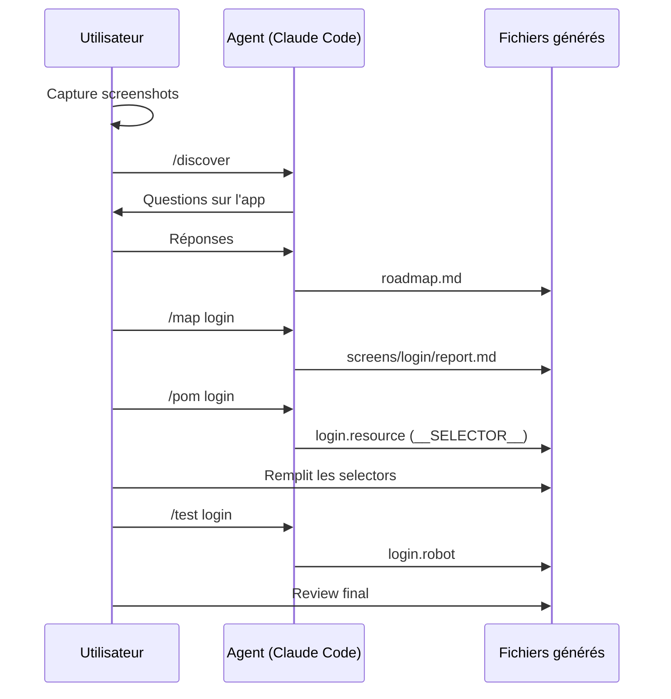
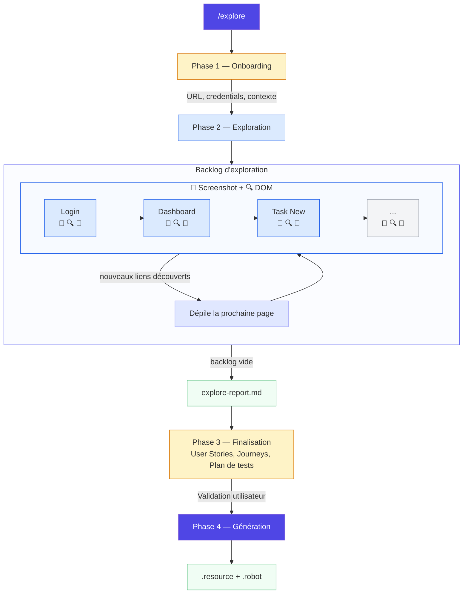
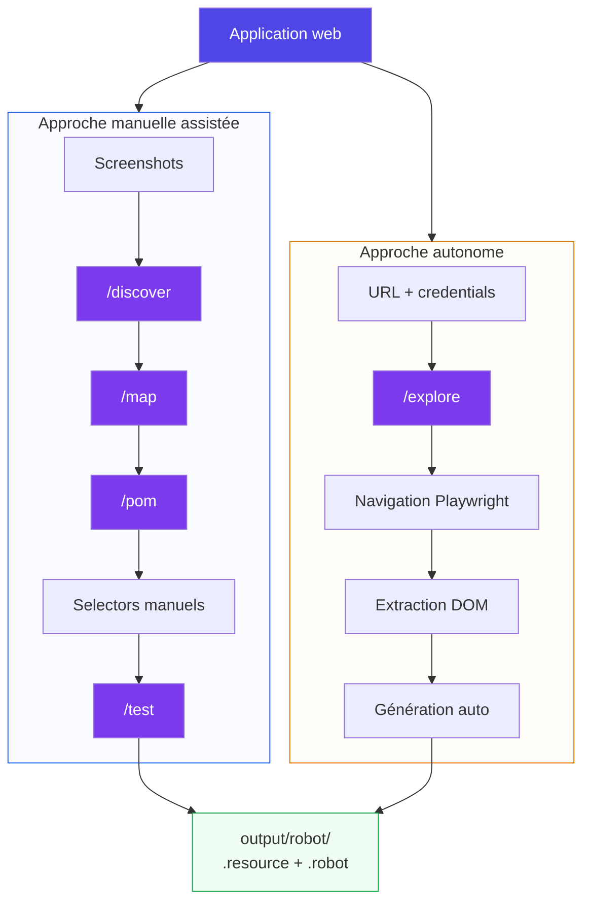

# Présentation — Demo eXalt Automation

## Intro

Comment l'IA peut automatiser la génération de tests end-to-end pour des applications web.

On part d'une application web existante et on arrive à des **tests Robot Framework fonctionnels**, générés par un agent IA (Claude Code), avec deux approches :

- **Approche manuelle assistée** : l'utilisateur capture les écrans, l'agent génère
- **Approche autonome** : l'agent explore, capture et génère sans intervention

---  

## Concepts clés

   
  
  
  

### Les skills

Les skills sont des **fichiers de connaissances spécialisées** chargés par les commandes au moment de l'exécution. Ils contiennent les conventions, patterns et règles propres à un framework ou un domaine.

Dans ce projet, les skills sont dans `.claude/skills/robot/` :

| Skill | Contenu |
|---|---|
| `conventions.md` | Nommage des variables, fichiers, keywords Robot |
| `pom.md` | Structure des fichiers `.resource`, règles de génération POM |
| `test.md` | Structure des fichiers `.robot`, style Gherkin, organisation |

**Relation commande → skill** : une commande comme `/pom` charge dynamiquement le skill `pom.md` du framework configuré. Cela rend le pipeline **agnostique du framework** — on pourrait ajouter des skills Cypress, Playwright Test, etc.



### MCP (Model Context Protocol)

MCP est un **protocole standard** qui permet à Claude Code de communiquer avec des outils externes. Au lieu de tout faire via le terminal, l'agent peut piloter directement des applications.

Dans ce projet, on utilise **Playwright MCP** : un serveur qui expose les capacités de Playwright (navigateur headless) à travers le protocole MCP.

Concrètement, l'agent peut :
- Ouvrir un navigateur et naviguer vers une URL
- Cliquer, remplir des formulaires, interagir avec la page
- Prendre des screenshots
- Lire le DOM et extraire des selectors
- Tout cela **sans écrire une seule ligne de code Playwright**

La configuration se fait dans `.mcp.json` :
```json
{
  "mcpServers": {
    "playwright": {
      "command": "npx",
      "args": ["@playwright/mcp@latest"]
    }
  }
}
```



---

## Les deux approches en détail

### Approche manuelle assistée

L'utilisateur pilote le processus :

1. Capturer les écrans de l'application (screenshots)
2. `/discover` — L'agent pose des questions, comprend l'app, génère une roadmap
3. `/map {écran}` — L'agent analyse les screenshots, identifie les éléments et interactions
4. `/pom {écran}` — L'agent génère les Page Object Models (`.resource`)
5. L'utilisateur remplit les selectors CSS/XPath (`__SELECTOR__`)
6. `/test {écran}` — L'agent génère les suites de tests (`.robot`)

**Avantages** : contrôle total, pas besoin que l'app tourne, fonctionne avec des maquettes

**Limites** : effort de capture manuelle, selectors à remplir à la main



### Approche autonome (Playwright MCP)

L'agent pilote tout :

1. L'utilisateur lance l'app et fournit l'URL
2. `/explore` — L'agent navigue dans l'app, capture chaque écran, extrait les éléments DOM, génère les mappings, les POM et les tests en une seule passe

**Avantages** : minimal d'effort humain, selectors extraits automatiquement, couverture exhaustive

**Limites** : l'app doit tourner, exploration parfois incomplète sur les apps complexes



---

## Fichiers générés

### Structure de sortie

```txt
output/robot/
├── resources/
│   ├── pages/           # Un .resource par écran
│   │   ├── login.resource
│   │   ├── dashboard.resource
│   │   └── ...
│   ├── layouts/         # Composants partagés
│   │   ├── navbar.resource
│   │   ├── sidebar.resource
│   │   └── footer.resource
│   └── common/          # Keywords transverses
└── tests/               # Suites de tests Gherkin
    ├── authentication/
    │   ├── login.robot
    │   └── logout.robot
    ├── dashboard/
    ├── tasks/
    └── users/
```

### Exemple de POM généré

```robot
*** Settings ***
Library    SeleniumLibrary

*** Variables ***
${LOGIN_INP_EMAIL}        id=email
${LOGIN_INP_PASSWORD}     id=password
${LOGIN_BTN_SUBMIT}       css=button[type="submit"]

*** Keywords ***
Fill Login Form
    [Arguments]    ${email}    ${password}
    Wait Until Element Is Visible    ${LOGIN_INP_EMAIL}
    Input Text    ${LOGIN_INP_EMAIL}    ${email}
    Input Text    ${LOGIN_INP_PASSWORD}    ${password}

Submit Login Form
    Click Button    ${LOGIN_BTN_SUBMIT}
```

### Exemple de test généré

```robot
*** Settings ***
Library     SeleniumLibrary
Resource    ../resources/pages/login.resource

*** Test Cases ***
User Can Login With Valid Credentials
    Given I Am On Login Page
    When I Fill Login Form    admin@test.com    password123
    And I Submit Login Form
    Then I Should See Dashboard
```

---

## Vue d'ensemble — Les deux approches


